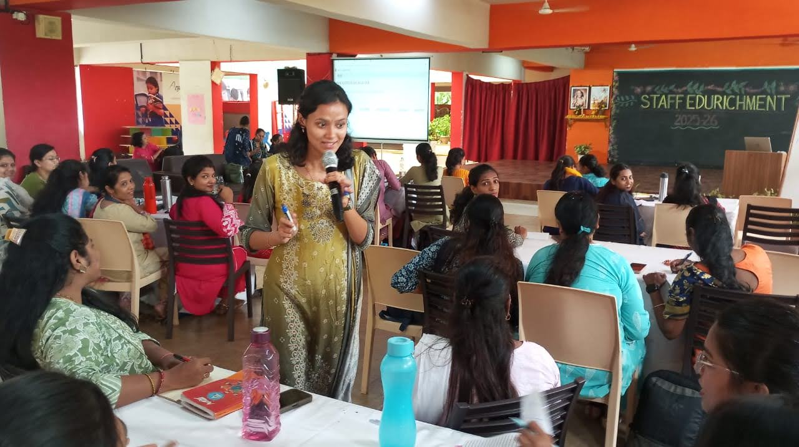

<h1 align="center">Hi, I'm Tejal Mahalpure 👋</h1>

Curriculum Designer &amp; Academic Programme Manager

  

  
  

  
  
  

<!--
  Placeholders to fill in:
  - LinkedIn link (line with "LinkedIn" badge) → replace href="#" with your LinkedIn URL
  - Portfolio link (line with "Portfolio" badge) → replace href="#" with your portfolio/website URL
-->

 

## 🎓 About Me

Curriculum designer and academic programme manager with six years' experience spanning school operations, teacher professional development, and educational technology across India and the UK. I've designed and facilitated professional development for **90+ teachers**, coordinated curriculum implementation across **15+ partner schools** supporting **500+ educators**, and led a **50-person project team** to deadline.

I'm currently completing a full-time **MEd in Education Studies** at Queen's University Belfast (through Jan 2027), researching teacher professional development, foundational literacy, and EdTech. I'm looking for curriculum design, learning design, or academic programmes roles in UK higher education, EdTech, or the education charity sector.

## 🧠 Core Skills

  
  
  
  
  

## 🛠️ Tools &amp; Platforms

  
  
  
  
  
  
  

## 💼 Experience Highlights

**Student Partnership Intern** · Strategy 2030, Queen's University Belfast — *Apr 2026–Present*
Researching sector practice to inform the design of the University's student partnership framework.

**Education Coach** · XSEED Education — *Oct 2024–Nov 2025*
Coordinated curriculum implementation across 15+ partner schools supporting 500+ educators; delivered full teacher development cycles from training through classroom follow-up.

**Research Consultant** · SpacECE India Foundation — *May 2024–Aug 2024*
Led a 50-person intern team to deliver an early years curriculum project on schedule, designing thematic learning resources and caregiver engagement interventions.

**Resource Curator** · Interactive Flat Panel Project, SCERT &amp; Tata Institute of Social Sciences — *Nov 2022–Feb 2023*
Adapted English curriculum resources for interactive flat panel delivery and trained teachers on classroom use of the technology.

**Academic Operations Lead** · Little Angels' School — *Mar 2020–Dec 2025*
Designed professional development programmes for 90+ teachers and school-wide academic programmes for 2,000+ students.

## 🎓 Education

- **MEd Education Studies** — Queen's University Belfast *(Jan 2026–Jan 2027)*
- **MA Education** — Tata Institute of Social Sciences, Mumbai *(2022–2024)*
- **BA Political Science** — Fergusson College, Pune *(2019–2022), First Class with Distinction*

## 📬 Let's Connect

  
  
  

